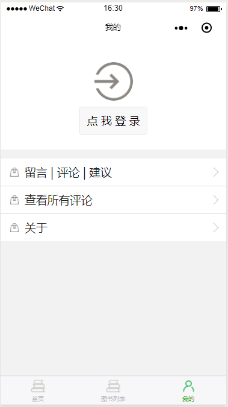

# 图灵小书架

## 项目介绍

定时抓取图灵社区官网的首页、最热、推荐和最新等栏目的相关信息进行展示，并且可以下载相关的 PDF 进行查阅...后台免部署，直接将代码引入微信开发者工具会自动连接到服务器进行数据交互和展示...

- Github：https://github.com/liqingwen2015/ituring_small_bookshelf
- Gitee：https://gitee.com/liqingwen/ituring_small_bookshelf
- 博客园：https://www.cnblogs.com/liqingwen/p/9339504.html
- 百度百科：https://baike.baidu.com/item/%E5%9B%BE%E7%81%B5%E5%B0%8F%E4%B9%A6%E6%9E%B6/56474937?fr=aladdin

## 扫描或搜索

### 方法一

### 方法二

搜索：【图灵小书架】

#### 主要功能截图

#### 软件架构

后台采用 .NET WebAPI（EF + AutoMapper + Autofac）

#### 使用说明

1. 打开微信开发者工具
2. 路径引入 src 文件夹
3. 输入 APPID 和文件名即可

#### 版本说明

v1.1 增加功能-历史上的今天
v1.0.1 修复缓存文件名称
v1.0 正式

